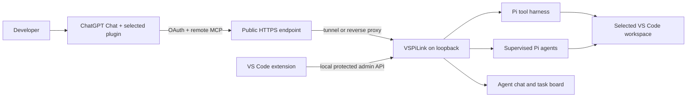

# VSPiLink — ChatGPT Workspace Bridge for VS Code

> **From chat to code, on your machine.**

<p align="center">
  
</p>

VSPiLink is a self-hosted, OAuth-protected MCP bridge between ChatGPT and the
Pi Agent coding-tool harness running beside your VS Code workspace. ChatGPT
remains the user-facing agent surface and inference provider; VSPiLink exposes controlled file,
Git, execution, collaboration, and supervised-agent capabilities on the
machine where the extension runs.

The project preserves the original
[PiLink](https://github.com/roccoangelella/PiLink) server and the collaboration
work from its
[`feature/agent-public-chat`](https://github.com/roccoangelella/PiLink/tree/feature/agent-public-chat)
branch, then adds a VS Code control surface, persistent hosting options, and an
optional local Pi chat.

VSPiLink is independent software. It is not affiliated with, endorsed by, or
distributed by OpenAI, Microsoft, or Cloudflare.

## What it does

- Connects normal **ChatGPT Chat** to a development machine through a personal
  remote-MCP plugin and OAuth.
- Keeps the default tool boundary inside the selected workspace, with explicit
  opt-ins for repository execution and unrestricted machine access.
- Shows MCP connections, durable agent messages, shared tasks, and supervised
  Pi agents in VS Code without copying the private ChatGPT transcript.
- Preserves PiLink CLI, Streamable HTTP, legacy SSE, OAuth client lifecycle,
  hosting modes, collaboration tools, and the original Pi provider login
  choices.
- Supports an optional **Pi Local** mode. Pi Local uses the selected provider
  and that provider's credentials, limits, and billing; it does not provide
  free inference.



See [Architecture](docs/ARCHITECTURE.md) for the runtime, trust, and identity
models.

## Choose a mode

| Mode | Model/client | Best for |
| --- | --- | --- |
| **ChatGPT Chat + MCP** | Normal Chat uses a selected server-specific VSPiLink personal plugin | The primary remote workflow |
| **Pi Local** | A provider and model selected in VSPiLink | Direct local chat and supervised child agents |
| **CLI/headless** | PiLink server plus optional Textual monitor | SSH, tmux, automation, and existing PiLink deployments |

Plugin creation and availability depend on the account and workspace policy.
Read [Usage, models, and costs](docs/USAGE_AND_COSTS.md) before choosing a model.

## Requirements

- VS Code 1.106 or newer;
- a VSPiLink-managed or existing **Node.js 24.18.0 exactly** on the machine
  that runs the VSPiLink sidecar;
- a trusted local or Remote SSH workspace;
- a public HTTPS endpoint for ChatGPT, normally a Cloudflare Named Tunnel
  or an existing reverse proxy/domain;
- a ChatGPT plan and policy that allow personal plugins and remote MCP tools.

Feature availability, labels, plans, credits, and limits are controlled by
OpenAI and may change independently of VSPiLink.

## Install

The recommended release bundle installs and verifies the bundled VSIX and, if
necessary, provisions a private per-user Node.js 24.18.0 runtime from the
official Node.js distribution using pinned SHA-256 values. It does not require
`sudo` and does not replace the user's system Node.

Linux or macOS, from the unpacked release directory:

```bash
./install.sh
```

Windows PowerShell, from the unpacked release directory:

```powershell
.\install.ps1
```

The release scripts use the `vspilink-2.2.0.vsix` beside them. They refuse an
unverified installation when `SHA256SUMS` is missing or does not match. When
the installer finishes, return to VS Code, open the Command Palette with
`Ctrl+Shift+P` (`Cmd+Shift+P` on macOS), run **Developer: Reload Window**, then
select **View -> Appearance -> Secondary Side Bar** if necessary and open the
VSPiLink view.

Developers building from source must provide Node.js 24.18.0 and npm 11.16.0
exactly:

```bash
git clone https://github.com/0xfunboy/VSPiLink.git
cd VSPiLink
node --version                    # must print v24.18.0
npm --version                     # must print 11.16.0
npm ci
npm run vscode:install
```

In a source checkout, the installer sources live under `install/`, but the
normal developer command is `npm run vscode:install`. Do not use the
release-root commands above until `npm run release:stage` has produced the
complete checksummed bundle.

For VSIX and Remote SSH instructions, see
[Installation](docs/INSTALLATION.md). For a visual version of the complete
first-run flow, use the sanitized [illustrated walkthrough](docs/ILLUSTRATED_GUIDE.md).

## Connect normal ChatGPT Chat

1. Open the project folder in VS Code and trust it only if you know its
   contents.
2. Open the VSPiLink sidebar and keep **ChatGPT MCP** selected.
3. Start the guided connection, select **Open folder** access, and configure a
   stable public HTTPS endpoint.
4. The wizard opens **ChatGPT → Plugins** once in the system browser with a
   one-use owner pairing. Click `+`, then copy the generated name, description
   and MCP URL into a new personal plugin for that exact server. Every
   additional machine gets a separate connection.
5. Complete OAuth once per server connection. When Dynamic Client
   Registration is available, no callback URL, client ID, or client secret
   needs to be copied manually.
6. Start a normal Chat, select that exact VSPiLink connection from Plugins,
   and review tool approvals and file changes in VS Code. After OAuth, normal
   Chat can return to VS Code's Integrated Browser.

The VSPiLink package is installed once, while ChatGPT app/connection instances
are per server. VSPiLink automatically generates a stable UUID, label,
fingerprint, display name and non-secret descriptor for each installation.
ChatGPT still assigns its private app ID inside the owner's account or
workspace and requires Create/Review plus OAuth consent. The deployment owner
creates one entry per server and shares those distinct entries through the
appropriate personal or workspace plugin source.

The optional plugin under `plugins/vspilink` is a separate **Codex-only local
plugin** that targets VSPiLink on loopback. It does not install, replace, or
configure the private ChatGPT connection.

The exact plugin-sharing control depends on account and workspace policy. If
the plugin is not available, do not install an unrelated catalog result named
"MCP server". Follow the canonical
[Connect ChatGPT guide](docs/CONNECT_CHATGPT.md).

## Security first

The default **Open folder** mode confines filesystem paths to the canonical
workspace root, rejects traversal and symlink escape, and does not expose a
general-purpose shell. Repository build and test profiles require a separate
trust decision because repository code is still arbitrary code.

**Full access is remote code execution by design.** It removes the filesystem
boundary and can launch processes with the permissions of the VSPiLink user.
Enable it only for a specific trusted OAuth client on a machine and account you
are willing to expose.

Secrets stay outside the workspace and webview. Public MCP/OAuth routes are
separate from loopback-only administration. Read the complete
[Security model](docs/SECURITY_MODEL.md) before exposing a server.

## Shipped capabilities

- workspace file read, search, edit, and write tools;
- constrained Git inspection and opt-in npm build/test profiles;
- explicit unrestricted shell/full-filesystem mode;
- OAuth Authorization Code with PKCE, refresh, revocation, DCR, and manual
  client compatibility;
- Streamable HTTP and legacy SSE on `/sse`;
- durable `agent_chat_*`, `agent_task_*`, `agent_work_*`, and read-only
  `agent_memory_*` collaboration surfaces;
- metadata-only tool audit and progress reporting;
- supervised Pi agent spawn, status, output, follow-up, cancel, and stop;
- existing HTTPS domain, Cloudflare Named/Quick Tunnel, local-only, and legacy
  `nip.io` hosting;
- optional Pi Local provider OAuth, device-code, existing-credential, and API
  key login paths;
- VS Code sidebar, wide dashboard, Integrated Browser launch, and protected
  local administration.

The detailed preservation contract is in
[Functional parity](docs/FUNCTIONAL_PARITY.md). Shipping behavior and future
plans are deliberately separated in [Product strategy](docs/PRODUCT_STRATEGY.md).

## CLI compatibility

```bash
pilink init
pilink start
pilink start --setup
pilink start --allow-unsafe-full-access
pilink serve
pilink chat
pilink reset
pilink hosting --help
pilink agent-auth --help
```

Do not let the CLI and extension own the same configuration simultaneously.
The Textual monitor requires its documented Python dependency; the normal VS
Code dashboard does not.

## Documentation

- [Documentation map](docs/README.md)
- [Installation](docs/INSTALLATION.md)
- [Illustrated setup walkthrough](docs/ILLUSTRATED_GUIDE.md)
- [Connect ChatGPT](docs/CONNECT_CHATGPT.md)
- [Usage, models, and costs](docs/USAGE_AND_COSTS.md)
- [Architecture](docs/ARCHITECTURE.md)
- [Security model](docs/SECURITY_MODEL.md)
- [Troubleshooting](docs/TROUBLESHOOTING.md)
- [Upstream lineage](docs/UPSTREAM_LINEAGE.md)

## Development

```bash
npm ci
npm run test:all
npm run vscode:package
```

All project packages intentionally require Node.js 24.18.0 and npm 11.16.0
exactly for source/developer builds. Release users may use the isolated managed
Node runtime provisioned by the installer.

## License and acknowledgements

Licensing scope and preserved third-party permissions are documented in [LICENSING.md](LICENSING.md). The [0xfunboy Non-Commercial License](LICENSE.md) covers eligible original material only.

VSPiLink is distributed under the [MIT License](LICENSE). Preserve the license
and copyright notice when redistributing substantial portions.

It derives from PiLink and uses the Pi Agent tool harness from
[`@earendil-works/pi-coding-agent`](https://www.npmjs.com/package/@earendil-works/pi-coding-agent).
See [Upstream lineage](docs/UPSTREAM_LINEAGE.md) for branch and commit-level
attribution.
